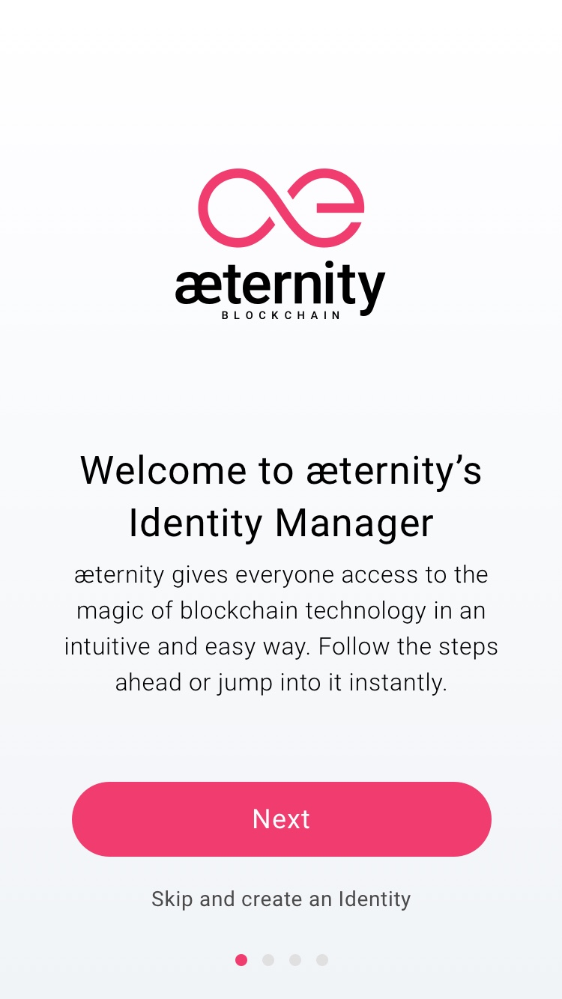
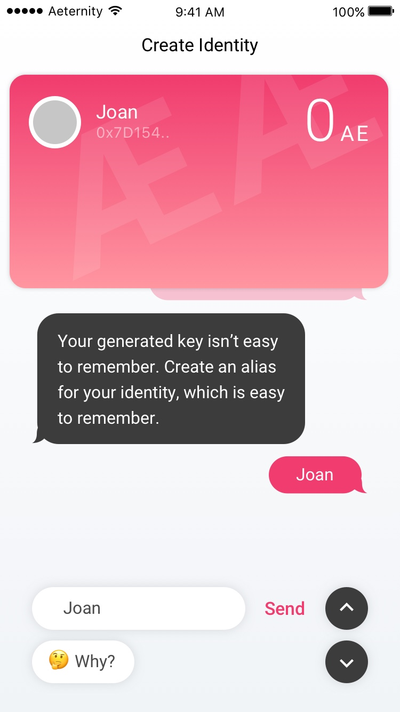

# Onboarding

Our goal is to provide access to the aeternity block chain with ease. Providing all necessary information for users who are unfamiliar with block chain concepts on one hand. On the other hand we want experts to be able to jump right into identity creation.
We created a conversational interface to implement this freedom of choice.

## Intro
The intro screens explain the core concepts of identities on the æternity blockchain. The meaning of keys is explaind and the possibility to give them an alias.

---

---

---

## Identity Creation

Users have to create at least one identity to interact with the æternity blockchain. From the technical perspective a identity is a derived addresses from a extended private key and might be connected to a profile and a public name. Profiles will be stored off chain.

The `Identity Creation` dialog provides a easy interface for beginners to set up their identites without overwhelmeing them with too much technical information at the same time. Additional information can be requested by the user at any point (`Why?` button).

Experienced users are free to skip explanations and provide the necessary.

A private identity is pre-made. The user is asked if she wants to leave it private, make it public, or leave everything and instantly go further and start using the app. If she decides to skip the onboarding there will be reminders later to securly back up her mnemonic pass phrase.

---

---

The key is explained, a security phrase if given and the user is prompted to write it down and confirm that he did.

---

Aliases are not public. They are just internal bookmarks to your address. Public identities can have public name and profile, which can be set up later. In this case its the primary public identity the user creates so she chooses to use her first name.

---

The card changes: key is more hidden, and the alias is more present.

---

The user is being called by her name, to make in more personal. She is also asked to upload an image to personalize the public identity. Images are stored off chain.

---

---

In the case that the user manually opened the Identity Manager, the user can visit the dashboard

## Next
[Jump to: Proof of Aexistence](proof-of-aexistence.md)
