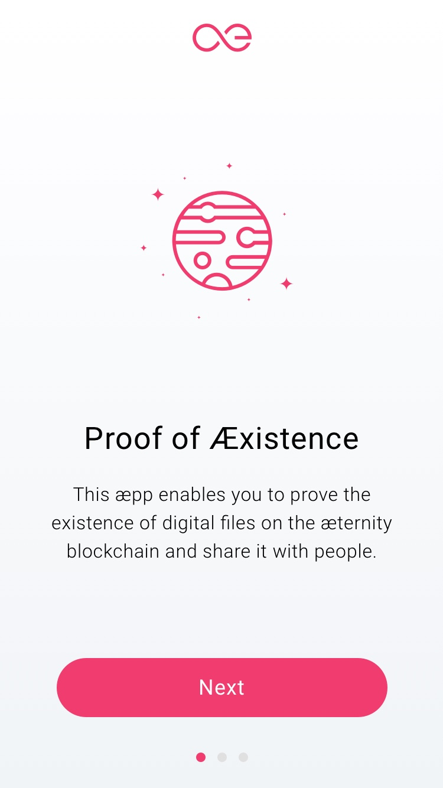
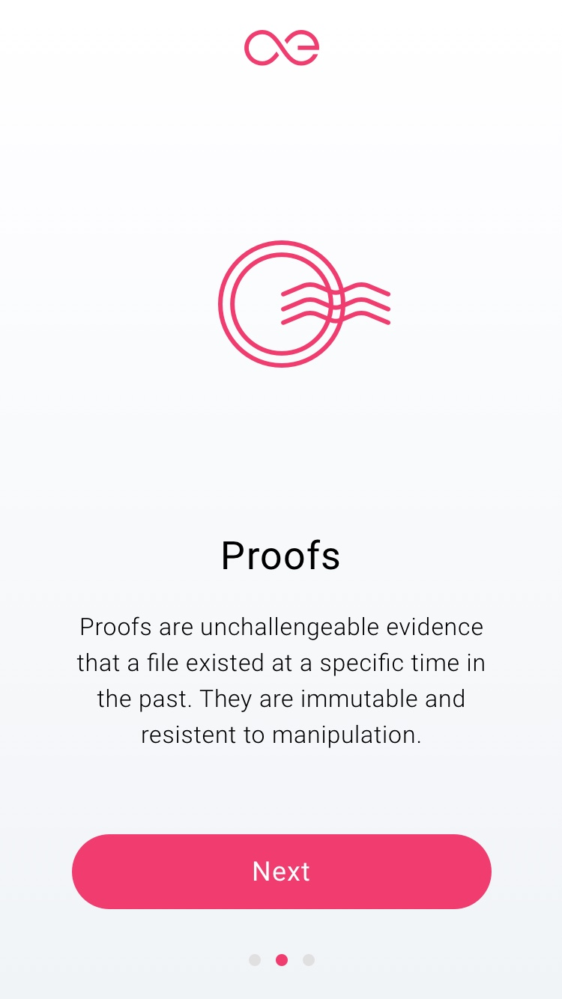
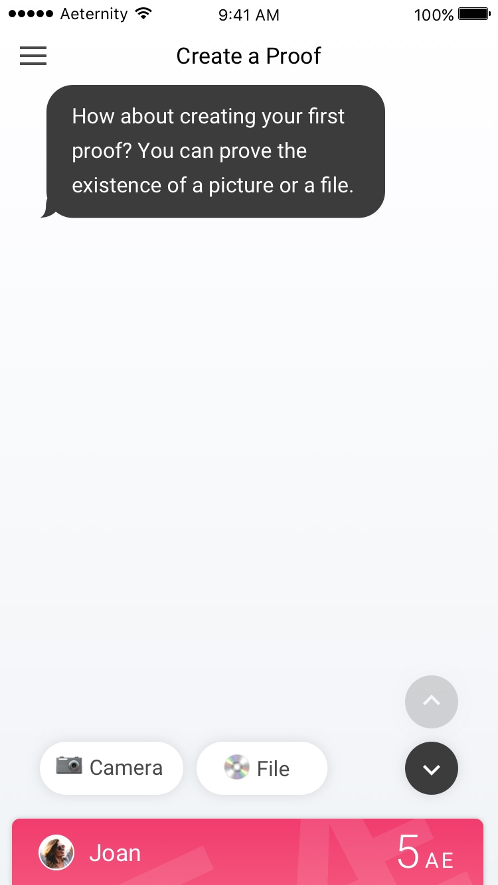
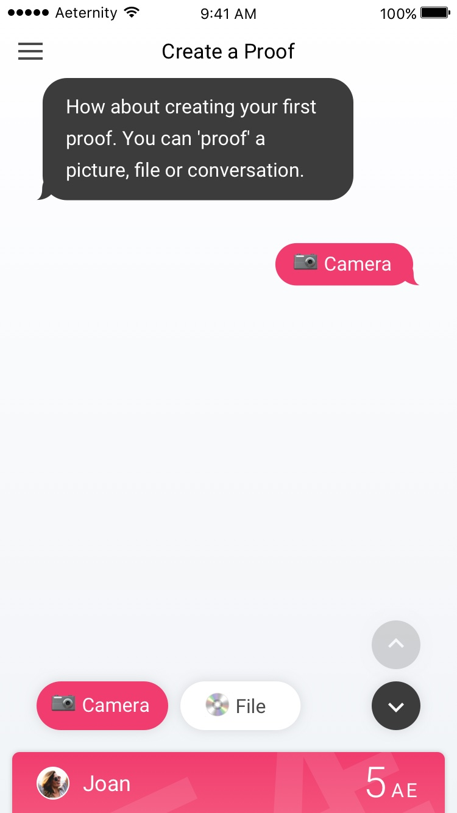
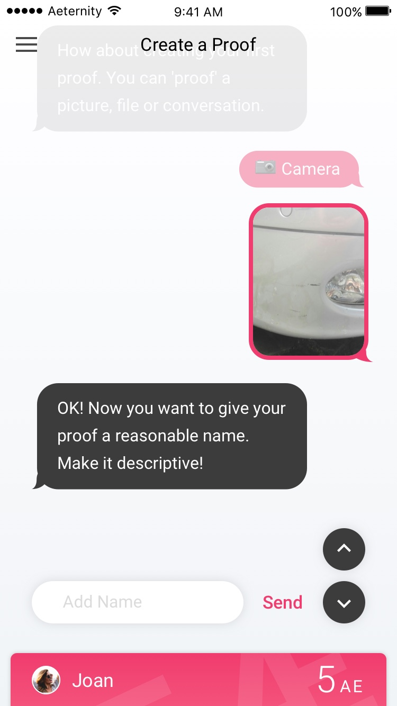
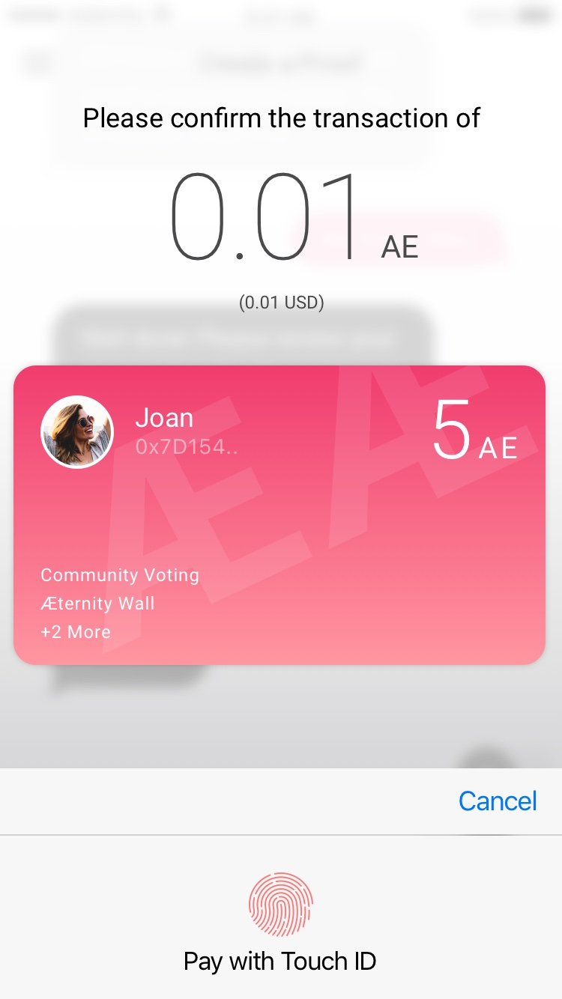
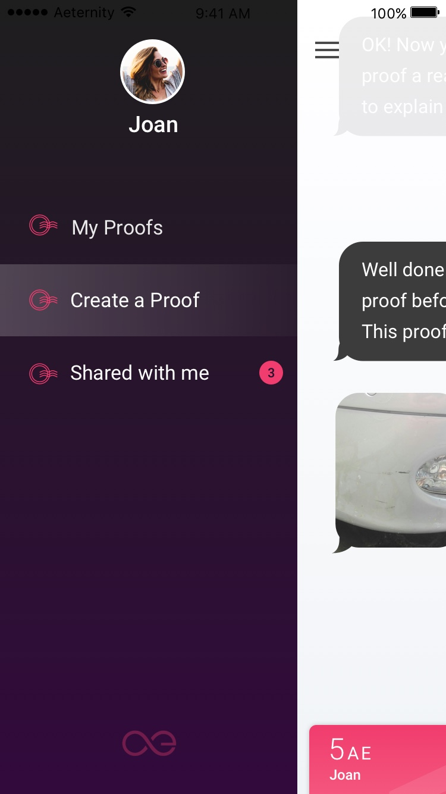

# Proof of Æxistence example

The Proof of Æxistence æpp provides a easey to use interface to create hashes of files and store them on the aeternity blockchain inside of a smart contract as a undeniable proof a file existed at a certain time in the past.

You can find a click dummy of this app [here](https://aeternity.github.io/aepp-aexistence).

This is a standalone æpp. It hase to authorize against the base æpp at some point to be able to spend funds on creating the proofs. After the introduction, the æpp switches to the base app for this request.

This æpp should become a best practice example on how to create a rich user experience for æternity blockchain æpps.

## Intro

Using the same introduction mechanism as in the base app creates a unified UX for novice users. The key concepts of the æpp should be explained in 3 - 5 sentences.

In the end of the intro the user is asked authorize the æpp in the base æpps identity manager. This will lead to creating an identity or pick an identity that exists already. Most æpps need to be connected with an identity for a full experience.

---

---

## Authorize in Identity Manager

The base æpp opens up the authorization screen. The user will be directed back to the Æxistance æpp after she successfully authorized the æpp with one of her identities. 

[Jump to: Authorization](authorization.md)

## Authorized - Create a proof

The main functinallity of an æpp should be the default screen after successful authorization. 

In an authorised æpp, the connected identity is always shown in the bottom and displys relevant information such as balance.

---

Forms are boring, so this conversational interface figures out the users intentions and information that are relevant, by asking simple questions.

The underlying complexity is hidden from the user. Whenever she doesn't understand the neccecity of an action or simply wants know more about the topic, she can retreive them with a simple question.

---

Proofs can be created from different media source. Files or images from the gallery or directly form the camera. In the future even videos, messages and sensor data are possible.

---

The camera has been chosen to create a proof.

---

---

---

---

Creating a proof costs æternity tokens. The transaction has to be confirmed by the user.

---

Sidemenu

---

A list of all created proofs

---

A detailed view of a proof. Here the user can see more information and share it with others to get more confirmations.

## Next
[Jump to: Identity Management](identity-management.md)
