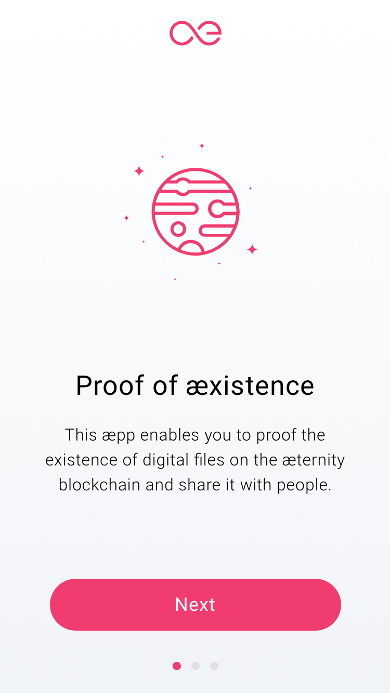
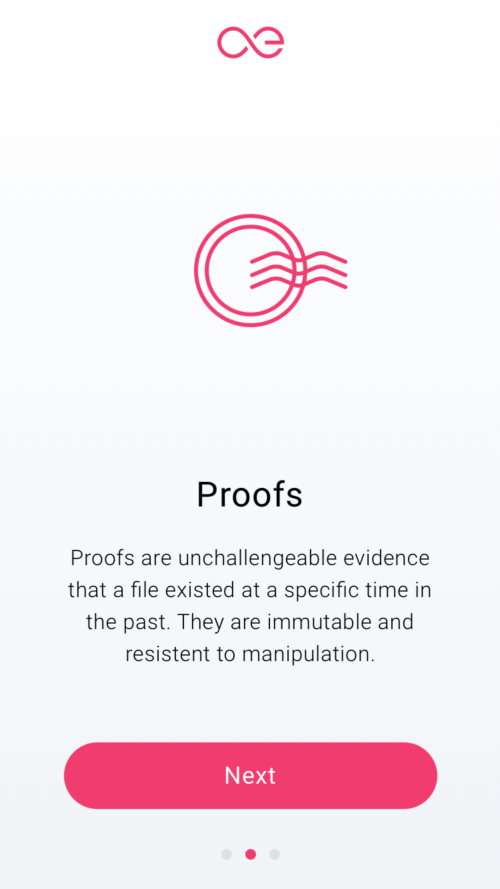

#Onboarding
## Intro

Intro Screen 1 explains the global goals of the æternity manager. Clicking the next button leads to the following intro screen, clicking on ‘skip and create an Identity’ leads to the on boarding part.

Intro Screen 2 explains that Identities can also be managed in the æternity manager

Intro Screen 3 explains the difference between Public & Private Identities

Intro Screen 4 explains the Key and the possibility to give them an alias

## Identity Creation

The onboarding starts, a private identity is pre-made for the user. The user sees it in the upper area of the screen. The lower area is a conversational interface. The first message from the app is that the card is made and that it’s private. The user is asked if he wants to leave it private, make it public, or leave everything and instantly go further and start using the app. Also a button is added for more information.

The User chooses “Make it Public”

The key is explained, a security phrase if given and the user is prompted to write it down and confirm that he did.

The user has confirmed that he has written it down

The user is given the option to add an alias in stead of the key.

User adds an alias.

The card changes: key is more hidden, and the alias is more present.

The user is being called by her name, to make in more personal. She is also asked to upload an image.

The user want to do it later.

The user takes an image.

In the case that a user came from another æpp, the user is asked to authorise that from where he came from.

In the case that the user manually opened the Identity Manager, the user can visit the dashboard

# Manage Identities
## Dashboard

The Dashboard is an overview of the following items:
	1.	Identities: First card is all identities combined, swiping to the right shows more cards, they represent the most frequently used identities.
	2.	Balance Summary of the last week, these information depends which card is selection in 1.
	3.	Recent transactions: also depending on which identity is selected in 1.
	4.	Currency History shows the value of the AE

The Dashboard when another Identity is selected

Sidemenu, Dashboard is active

## My Identities

A listview of all identities, the frequently used is shown on top.

Sidemenu, My Identities is active

All Identities, scrolled down.

When the user taps the search field and enters an identity name, a more compact list is shown. This is useful when the user has a lot identities.

The details of an identity is similar to the Dashboard, extra items are added: Authorised æpps and a graph that shows the recent balance of this certain Identity.

An  authorised æpp has been selected. In this detailed view the user sees the transactions that are made with the authorised æpp. The user has the option to revoke authorisation.

## Transfer Tokens between Identities

The user can make internal transactions here. In the upper area the user can add an amount of AE Tokens. ‘Transfer from’ shows the identity where the transfer is coming from. ‘Transfer to’ shows the identity which will receive the transaction.

Sidemenu, Transfer Internally is active

The amount is filled in

## Authorise an aepp

A list of all authorised æpps. Clicking on it shows details.

Sidemenu, Authorised æpps is active

In this detail view the user sees the transactions that are made with the authorised æpp. The user has the option to revoke authorisation. It is the same view as 4.6.

# Proof of Aexistence
## Intro

The Proof of æxistence is being explained.

A single Proof is being explained.

The user is asked to open the Identity Manager, this will lead to creating an Identity or pick an identity that is already been created.

## Create a proof

When the user has created an identity and/or authorised an existing one in the Identity Manager, she will come back to this screen. Where she is been informed that the authorisation has been successful.

A conversational interface askes the user to create her first proof. The option to create a proof with the camera or a file has been given. In an authorised æpp, the connecting identity is always shown in the bottom. Therefor, the user always knows which one is connected to this æpp.

The camera has been chosen to create a proof.

The app asked for the name of the proof, the user enters it.

Creating a proof costs money, clicking on the make payment button will result in the active identity card to been shown completely and the user needs to confirm the payment with (for instance) the Touch ID security in iOS.

Sidemenu, Create a Proof is active

A list of all created proofs

A detailed view of a proof. Here the user can see more information and share it with others to get more confirmations.

This is the authorisation part of the Identity Manager, where the user lands when another æpp requires an authorisation and the user already has created identities. It’s the formiliar list view of all the Identities.

# Authorise an aepp

Authorisation part, scrolled down.

Authorisation part, but where the user has searched for a certain identity. A more compact list view is shown. Clicking on authorise will lead the user to 12.4

To confirm the request to authorise another æpp, the user needs to securely approve it with (for instance) the Touch ID in iOS.
